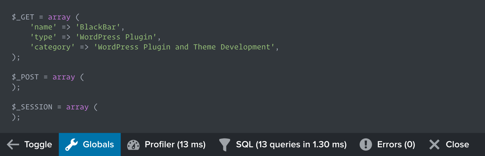

# BlackBar

    

BlackBar is an unobtrusive Debug Bar for WordPress developers that attaches itself to the bottom of the browser window. It is a rewrite of [blackbox-debug-bar](https://wordpress.org/plugins/blackbox-debug-bar/) by [Grzegorz Winiarski](https://profiles.wordpress.org/gwin) which appears to be abandoned as it has not been updated since 2013.

### How it helps you with development

- Debug both the front-end and admin area
- Displays any PHP errors that occur when loading a page
- Displays executed MySQL queries and the time it took to execute each query
- Displays the loaded theme template files (if using the [Castor Framework](https://github.com/geminilabs/castor-framework))
- Inspect global variables (GET, POST, COOKIE, SERVER)
- Use the Profiler for measuring performance of your plugins and themes

### Minimum plugin requirements

* PHP 5.6
* WordPress 4.0.0
